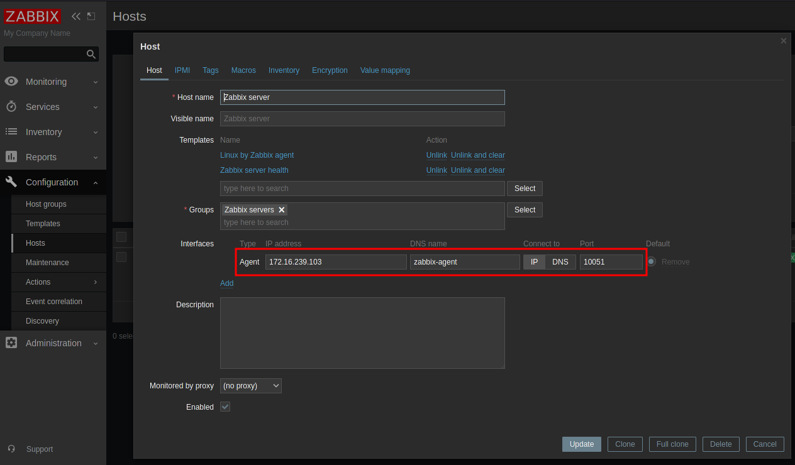
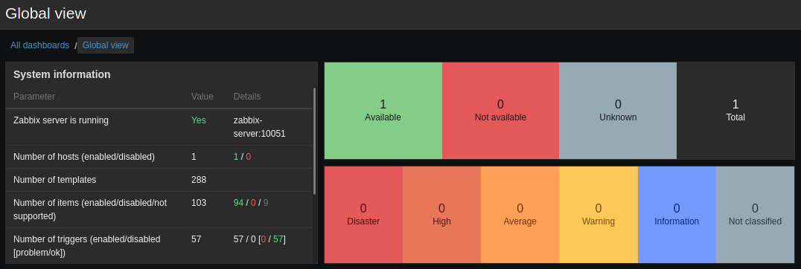

# Zabbix Server Compose


> This is the updated setup guide for __Zabbix Server v6__ via docker-compose. Version 6 is currently still under development and only available as a __Release Candidate__ `rc1`. For a setup guide for the stable __Version 5.4__ check the [5.4 README](/README_v5.4.md). Also note that the __docker_compose.yml__ file and __env_vars/.env_agent__ had to be modified for version 6.

<!-- TOC -->

- [Zabbix Server Compose](#zabbix-server-compose)
  - [Basic Setup](#basic-setup)
    - [Clone the Repository](#clone-the-repository)
    - [Go Dark](#go-dark)
    - [Change the Admin Login](#change-the-admin-login)
    - [Connect the Zabbix Agent](#connect-the-zabbix-agent)

<!-- /TOC -->

## Basic Setup

### Clone the Repository

```bash
git clone https://github.com/mpolinowski/zabbix-server-compose.git
```

### Go Dark


### Change the Admin Login

Visit the Zabbix Frontend on Port `8080` and login with:


> Username: __Admin__
> Password: __zabbix__


Enter the __User Configuration__ and change the `Admin` login:


### Connect the Zabbix Agent


The Zabbix Server expects an agent to be running on `localhost`. Since we are inside the Docker virtual network we need to change the default setting:


Go to __Configuration__ / __Hosts__ and change the Zabbix Agent IP / DDNS address according to the configuration you defined inside the `docker-compose.yml` file:


```yml
networks:
      zbx_net_backend:
        ipv4_address: 172.16.239.103
        aliases:
          - zabbix-agent
```





If everything worked the agent should show up after "a few Minutes":


