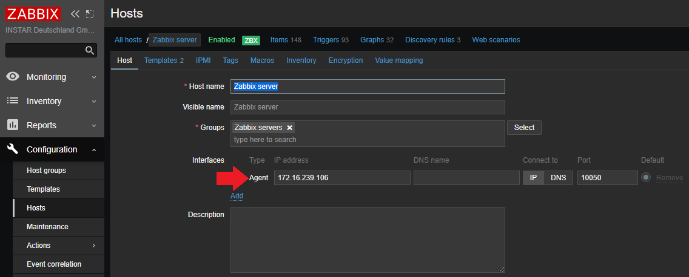

# Zabbix Server 5.4

<!-- TOC -->

- [Docker Compose Setup](#docker-compose-setup)
  - [Changes](#changes)
- [UPDATE :: Zabbix Agent v2](#update--zabbix-agent-v2)
- [What is Zabbix?](#what-is-zabbix)
  - [Zabbix Dockerfiles](#zabbix-dockerfiles)
    - [Base Docker Image](#base-docker-image)
    - [Usage](#usage)
  - [Issues and Wiki](#issues-and-wiki)
  - [Contributing](#contributing)

<!-- /TOC -->

## Docker Compose Setup

This is a fork of the [official Zabbix Server Repo](https://github.com/zabbix/zabbix-docker) with a few changes for a production setup:

### Changes

1. Removed everything I don't need - this file only sets up the Zabbix Server with a Postgres backend, the Zabbix Server Dashboard frontend using NGINX and an Zabbix Agent 1 to monitor the server itself.
2. Added container names, container restart policies and fixed IP addresses (The Zabbix Agent Container IP is set to `172.16.239.106` - **MAKE SURE** to change the agent address from default `127.0.0.1` to `172.16.239.106` inside the Server Dashboard! _see below_). __Alternatively__, use the container name `zabbix-agent`. It will resolve to the IP address inside the docker network.
3. Added an additional external network `ingress_gateway` that will be used by the system ingress to direct traffic to Zabbix. The web frontend container opens both port `8080` and `8443` to debug the initial setup (SSL will be handled by the Ingress and is not configured on port `8443`). The ports can be commented out later. Make sure to either remove the `ingress_gateway` from the configuration file or add it manually `docker network create ingress_gateway` before starting the containers.



## UPDATE :: Zabbix Agent v2

Using Zabbix Agent v2 (non-dockerized) for your Zabbix server:

1. Comment out `zabbix-agent` in the docker-compose file.
2. Install Agent 2:

```bash
wget https://repo.zabbix.com/zabbix/5.4/debian/pool/main/z/zabbix-release/zabbix-release_5.4-1%2Bdebian11_all.deb
dpkg -i zabbix-release_5.4-1+debian11_all.deb
apt update && apt install zabbix-agent2
```

3. [Configure Agent v2](https://mpolinowski.github.io/devnotes/devnotes/2020-07-16--zabbix-agent) - see [potential issue](https://mpolinowski.github.io/devnotes/2021-10-14--zabbix-docker-monitor):

_/etc/zabbix/zabbix_agent2.conf_

```conf
# This is a configuration file for Zabbix agent 2 (Unix)
PidFile=/var/run/zabbix/zabbix_agent2.pid
LogFile=/var/log/zabbix/zabbix_agent2.log
LogFileSize=100
DebugLevel=3
Server=172.16.238.101
ListenPort=10050
Hostname=zabbix_server
Include=/etc/zabbix/zabbix_agent2.d/*.conf
ControlSocket=/tmp/agent.sock
TLSConnect=psk
TLSAccept=psk
TLSPSKIdentity=zabbix_server
TLSPSKFile=/opt/zabbix/agent_tls.psk
Plugins.Docker.Endpoint=unix:///var/run/docker.sock
```

Point your agent on your host system towards to docker container running the Zabbix server (see Docker-Compose file for IP, **default** = `172.16.238.101`). And generate the pre shared key in `/opt/zabbix/agent_tls.psk`:

```bash
openssl rand -hex 32 > /opt/zabbix/agent_tls.psk
```

The server now has to be pointed to the Zabbix Server WAN IP:


## What is Zabbix?

Zabbix is an enterprise-class open source distributed monitoring solution.

Zabbix is software that monitors numerous parameters of a network and the health and integrity of servers. Zabbix uses a flexible notification mechanism that allows users to configure e-mail based alerts for virtually any event. This allows a fast reaction to server problems. Zabbix offers excellent reporting and data visualisation features based on the stored data. This makes Zabbix ideal for capacity planning.

For more information and related downloads for Zabbix components, please visit https://hub.docker.com/u/zabbix/ and https://zabbix.com

[](https://github.com/zabbix/zabbix-docker/actions/workflows/images_build.yml)
[](https://github.com/zabbix/zabbix-docker/actions/workflows/images_build.yml)

[](https://github.com/zabbix/zabbix-docker/actions/workflows/images_build_windows.yml)
[](https://github.com/zabbix/zabbix-docker/actions/workflows/images_build_windows.yml)

[](https://github.com/zabbix/zabbix-docker/actions/workflows/nightly_build.yml)

### Zabbix Dockerfiles

This repository contains **Dockerfile** of [Zabbix](https://zabbix.com/) for [Docker](https://www.docker.com/)'s [automated build](https://registry.hub.docker.com/u/zabbix/) published to the public [Docker Hub Registry](https://registry.hub.docker.com/).

#### Base Docker Image

- [alpine](https://hub.docker.com/_/alpine/)
- [centos](https://hub.docker.com/_/centos/) till Zabbix 5.0
- [oracle linux](https://hub.docker.com/_/oraclelinux/) from Zabbix 5.0
- [ubuntu](https://hub.docker.com/_/ubuntu/)

> **Important information: All Zabbix images based on CentOS 8 image can not be updated anymore because CentOS 8 base image is outdated (base image is not updated for half year). Because of that all images based on CentOS 8 replaced with Oracle Linux 8 as base image.**

#### Usage

There is some documentation and examples in the [official Zabbix Documentation](https://www.zabbix.com/documentation/current/manual/installation/containers)!

Please also follow usage instructions of each Zabbix component image:

- [zabbix-appliance](https://hub.docker.com/r/zabbix/zabbix-appliance/) - Zabbix appliance with built-in MySQL server, Zabbix server, Zabbix Java Gateway and Zabbix frontend based on Nginx web-server

  > **Important information: Zabbix Docker Appliance has been decommissioned (except Red Hat edition) and will not be available for 3.0.31, 4.0.19, 4.4.7, 5.0.0 and newer releases. Please use a separate Docker images for each component instead of the all-in-one solution.**

- [zabbix-agent](https://hub.docker.com/r/zabbix/zabbix-agent/) - Zabbix agent
- [zabbix-agent2](https://hub.docker.com/r/zabbix/zabbix-agent2/) - Zabbix agent 2
- [zabbix-server-mysql](https://hub.docker.com/r/zabbix/zabbix-server-mysql/) - Zabbix server with MySQL database support
- [zabbix-server-pgsql](https://hub.docker.com/r/zabbix/zabbix-server-pgsql/) - Zabbix server with PostgreSQL database support
- [zabbix-web-apache-mysql](https://hub.docker.com/r/zabbix/zabbix-web-apache-mysql/) - Zabbix web interface on Apache2 web server with MySQL database support
- [zabbix-web-apache-pgsql](https://hub.docker.com/r/zabbix/zabbix-web-apache-pgsql/) - Zabbix web interface on Apache2 web server with PostgreSQL database support
- [zabbix-web-nginx-mysql](https://hub.docker.com/r/zabbix/zabbix-web-nginx-mysql/) - Zabbix web interface on Nginx web server with MySQL database support
- [zabbix-web-nginx-pgsql](https://hub.docker.com/r/zabbix/zabbix-web-nginx-pgsql/) - Zabbix web interface on Nginx web server with PostgreSQL database support
- [zabbix-proxy-sqlite3](https://hub.docker.com/r/zabbix/zabbix-proxy-sqlite3/) - Zabbix proxy with SQLite3 database support
- [zabbix-proxy-mysql](https://hub.docker.com/r/zabbix/zabbix-proxy-mysql/) - Zabbix proxy with MySQL database support
- [zabbix-java-gateway](https://hub.docker.com/r/zabbix/zabbix-java-gateway/) - Zabbix Java Gateway
- [zabbix-web-service](https://hub.docker.com/r/zabbix/zabbix-web-service/) - Zabbix web service for performing various tasks using headless web browser (for example, reporting)
- [zabbix-snmptraps](https://hub.docker.com/r/zabbix/zabbix-snmptraps/) - Additional container image for Zabbix server and Zabbix proxy to support SNMP traps

### Issues and Wiki

Be sure to check [the Wiki-page](https://github.com/zabbix/zabbix-docker/wiki) on common problems and questions. If you still have problems with or questions about the images, please contact us through a [GitHub issue](https://github.com/zabbix/zabbix-docker/issues).

### Contributing

You are invited to contribute new features, fixes, or updates, large or small; we are always thrilled to receive pull requests, and do our best to process them as fast as we can.

Before you start to code, we recommend discussing your plans through a [GitHub issue](https://github.com/zabbix/zabbix-docker/issues), especially for more ambitious contributions. This gives other contributors a chance to point you in the right direction, give you feedback on your design, and help you find out if someone else is working on the same thing.
