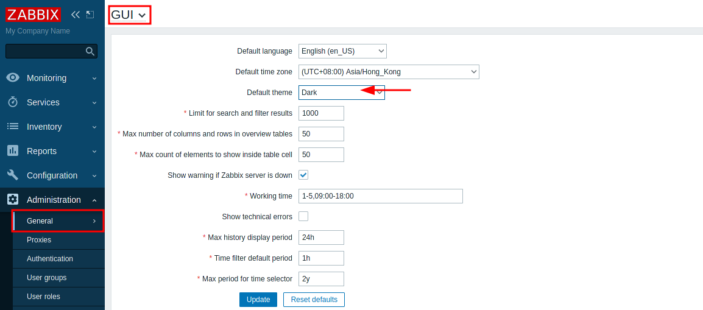

# Zabbix Server Compose


This is a fork of the official Zabbix Server Repo with a few changes for a production setup:

__Changes__

1. Removed everything I don't need - this file only sets up the Zabbix Server with a Postgres backend, the Zabbix Server Dashboard frontend using NGINX and an Zabbix Agent 2 to monitor the server itself.
2. Added container names, container restart policies and fixed IP addresses (The Zabbix Agent Container IP is set to `172.16.239.106` - MAKE SURE to change the agent address from default `127.0.0.1` to `172.16.239`.106 inside the Server Dashboard! see below).
3. Added an additional external network ingress_gateway that will be used by the system ingress to direct traffic to Zabbix. The web frontend container opens both port 8080 and 8443 to debug the initial setup (SSL will be handled by the Ingress and is not configured on port 8443). The ports can be commented out later. Make sure to either remove the `ingress_gateway` from the configuration file or add it manually `docker network create ingress_gateway` before starting the containers.
4. __OPTIONAL__: Added Grafana dashboard. See [Blog Entry for details](https://mpolinowski.github.io/devnotes/2022-01-15--zabbix-grafana-dashboard). The Grafana container is commented out in the docker-compose file - add as required.


> This is the updated setup guide for __Zabbix Server v6__ via docker-compose. Version 6 is currently still under development and only available as a __Release Candidate__ `rc1`. For a setup guide for the stable __Version 5.4__ check the [5.4 README](/README_v5.4.md). Also note that the __docker_compose.yml__ file and __env_vars/.env_agent__ had to be modified for version 6.

<!-- TOC -->

- [Zabbix Server Compose](#zabbix-server-compose)
  - [Basic Setup](#basic-setup)
    - [Clone the Repository](#clone-the-repository)
    - [Go Dark](#go-dark)
    - [Change the Admin Login](#change-the-admin-login)
    - [Connect the Zabbix Agent](#connect-the-zabbix-agent)

<!-- /TOC -->

## Basic Setup

### Clone the Repository

```bash
git clone https://github.com/mpolinowski/zabbix-server-compose.git
```

### Go Dark




### Change the Admin Login

Visit the Zabbix Frontend on Port `8080` and login with:


> Username: __Admin__
> Password: __zabbix__


Enter the __User Configuration__ and change the `Admin` login:


### Connect the Zabbix Agent


The Zabbix Server expects an agent to be running on `localhost`. Since we are inside the Docker virtual network we need to change the default setting:


Go to __Configuration__ / __Hosts__ and change the Zabbix Agent IP / DDNS address according to the configuration you defined inside the `docker-compose.yml` file:


```yml
networks:
      zbx_net_backend:
        ipv4_address: 172.16.239.103
        aliases:
          - zabbix-agent
```


If everything worked the agent should show up after "a few Minutes":


